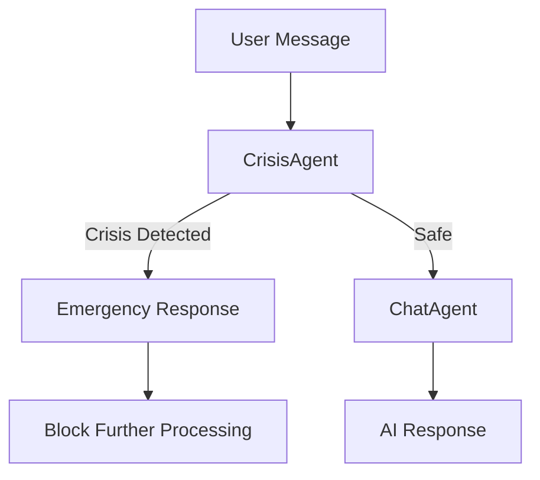

# Multi-Agent System Architecture

## Overview

The wellness journal application now uses a multi-agent system where specialized agents handle different aspects of user interactions.

## Agent Structure

```
Agents/
├── __init__.py          # Package exports
├── base_agent.py        # Base class for all agents
├── orchestrator.py      # Coordinates agent interactions
├── crisis_agent.py      # Crisis detection (Level 1: Regex, Level 2: Semantic)
├── context_agent.py     # Session context management
├── sentiment_agent.py   # Emotion analysis from journal entries
└── chat_agent.py        # Conversational responses
```

## Agent Responsibilities

### 1. CrisisAgent
**Purpose**: First absolute filter - blocks unsafe messages before they reach other agents.

**Detection Levels**:
- **Level 1 (Regex)**: Fast pattern matching for crisis keywords
  - Detects: "voglio morire", "pensieri suicidi", "suicidio", etc.
  - Avoids false positives like "muoio dal ridere"
  
- **Level 2 (Optional Semantic Check)**: AI-powered context verification
  - Can be enabled via config: `{"enable_semantic": True}`
  - Makes quick API call to verify genuine crisis intent

**Output**: 
- `CrisisResult(is_crisis: bool, response_text: str)`
- If `is_crisis=True`, returns emergency contact numbers and blocks further processing

**Example**:
```python
from Agents import CrisisAgent

agent = CrisisAgent(config={"enable_semantic": False})
result = agent.run("Voglio morire")

if result:
    print(result.response_text)  # Emergency contacts
    # Block ChatAgent from processing
```

### 2. SentimentAgent
**Purpose**: Analyzes journal entries to extract emotional signals.

**Output**: Dictionary with sentiment scores (0-10):
```python
{
    'stress': float,
    'happiness': float,
    'energy': float,
    'calm': float,
    'motivation': float
}
```

**Usage**: Powers the statistics dashboard charts.

### 3. ChatAgent
**Purpose**: Generates empathetic, supportive conversational responses.

**Important**: Only invoked AFTER CrisisAgent has cleared the message as safe.

**Input**: 
- `message`: User's text
- `context` (optional): Conversation history, user profile, recent entries

**Output**: AI-generated response string

### 4. ContextAgent
**Purpose**: Manages contextual information across sessions.

**Future Implementation**: Will store and retrieve:
- Conversation history
- User preferences
- Long-term patterns
- Session state

### 5. Orchestrator
**Purpose**: Coordinates interactions between agents.

**Flow**:
```
User Message → CrisisAgent → [STOP if crisis] → ChatAgent → Response
```

**Example**:
```python
orchestrator = Orchestrator()
orchestrator.register_agent(crisis_agent)
orchestrator.register_agent(chat_agent)
```

## Message Processing Flow



## Configuration

### CrisisAgent Config
```python
config = {
    "enable_semantic": False,  # Enable Level 2 semantic check
    "semantic_model": "gemini-1.5-flash"  # Model for semantic check
}
```

### ChatAgent Config
```python
config = {
    "model": "gemini-1.5-pro",
    "temperature": 0.7,
    "max_tokens": 1000
}
```

### SentimentAgent Config
```python
config = {
    "model": "gemini-1.5-flash"
}
```

## Testing

Run the test suite to verify all agents:
```bash
python test_agents.py
```

**Test Results**:
```
✓ CrisisAgent correctly detects "Voglio morire"
✓ CrisisAgent ignores false positives like "Muoio dal ridere"
✓ SentimentAgent returns sentiment scores
✓ ChatAgent generates responses
✓ Orchestration properly blocks ChatAgent on crisis
✓ Orchestration allows ChatAgent for safe messages
```

## Next Steps

1. **Integrate Gemini API** into CrisisAgent Level 2 semantic check
2. **Implement full ChatAgent** with actual Gemini API calls
3. **Implement SentimentAgent** analysis with Gemini
4. **Build ContextAgent** for session management
5. **Update Flask routes** to use orchestrator instead of direct agent calls
6. **Add logging** for all agent interactions
7. **Monitor and tune** regex patterns based on real usage

## Safety Guarantees

- CrisisAgent ALWAYS runs first
- No message bypasses crisis detection
- Crisis responses are hard-coded (no AI generation) to avoid hallucinations
- Emergency contact numbers are immediately provided
